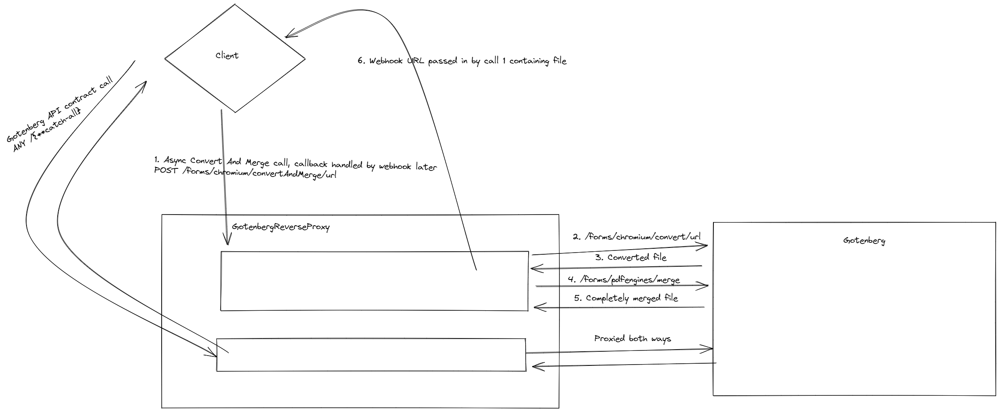

# GotenbergReverseProxy

## What does this do?



## Requirements

- Docker + docker-compose
- .NET 6.0

## How to use

- Run `docker-compose up gotenberg` to run the PDF generator.
- Run `dotnet run` to run this application

### URL to PDF conversion + additional files merging

- The POST `/forms/chromium/convertAndMerge/url` endpoint provides the conversion and merging functionality
- Use the following cURL to test a url to pdf conversion + merge with other PDF files:

```curl 
curl --location --request POST 'http://localhost:5000/forms/chromium/convertAndMerge/url' \
--header 'Gotenberg-Output-Filename: pdf.pdf' \
--header 'Gotenberg-Webhook-Url: http://localhost:5000/test' \
--header 'Gotenberg-Webhook-Method: POST' \
--header 'Gotenberg-Trace: 5812ef98-ba44-4339-a4a5-516fdf0bdb98' \
--form 'files=@"/C:/Users/Alex/Downloads/PDF1.pdf"' \
--form 'files=@"/C:/Users/Alex/Downloads/PDF2.pdf"' \
--form 'url="https://xentricator.be"'
```

- Be sure to change all the `files` properties to actual files on your system.
    - The order in which you include files determines the order in which they get merged behind the PDF that gets converted from the URL.
- The `url` property denotes the URL to be converted as a PDF
- Not every possible header of Gotenberg gets passed through on this route, visit `GotenbergReverseProxy.Constants.GotenbergHeaders` for the available
  headers.

### Any other kind of PDF conversion (without merging)

- Any other kind of PDF conversion follows the [API of Gotenberg](https://gotenberg.dev/docs/modules/api) as these calls get proxied directly to the Gotenberg
  instance by the `/{**catch-all}` route.

- Testing the proxy can be done with the following `cURL`:

```curl
- curl --location --request POST 'http://localhost:5000/forms/chromium/convert/url' \
  --form 'url="https://xentricator.be"' \
  --form 'paperWidth="8.27"' \
  --form 'paperHeight="11.7"' \
  --form 'marginTop="1"' \
  --form 'marginBottom="1"' \
  --form 'marginLeft="1"' \
  --form 'marginRight="1"' \
  --form 'preferCssPageSize="false"' \
  --form 'printBackground="true"' \
  --form 'landscape="true"' \
  --form 'scale="2.0"' \
  --form 'nativePageRanges="1-5"'
```

### Test callback endpoint

- There is a `/test` endpoint available in debug mode which does not get included in a `Release` build.
    - This endpoint can be used to test the entire flow. It creates a file with the filename, as used in the `Gotenberg-Output-Filename` header.

### Known issues

- If you get exceptions such as:

```
   Microsoft.AspNetCore.Server.Kestrel.Core.BadHttpRequestException: Reading the request body timed out due to data arriving too slowly. See MinRequestBodyDataRate.
```

or

```
 System.IO.IOException: Unexpected end of Stream, the content may have already been read by another component.
```

Try using `HTTPS` combined with the `5001` port instead of `5000`. The HTTPS redirect seems to do weird things with streaming multipart/form-data.
Source: [https://stackoverflow.com/a/55598786](https://stackoverflow.com/a/55598786)

### How to use in Kubernetes

- Build Docker image: `docker build . -t gotenberg-reverse-proxy:v0.3`
- Deploy to container registry (or build locally inside minikube when using minikube with `eval $(minikube docker-env)`)
- Change pod.yml to match image tag `gotenberg-reverse-proxy:v0.3`
- Deploy to Kubernetes:

```
kubectl apply -f ./k8s/pod.yml
kubectl apply -f ./k8s/svc.yml
kubectl apply -f ./k8s/svc-proxy.yml
```